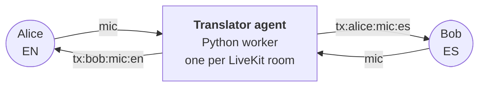

# Live Translate

Multi-language video calls with real-time AI voice translation. Everyone picks their language. Translation spins up on demand — same-language pairs cost nothing.

Powered by [LiveKit Agents](https://docs.livekit.io/agents/) (Python worker) and the [Gemini Live API](https://ai.google.dev/gemini-api/docs/live).

  

---

## What it does

Anyone with the link joins as a peer. Each participant picks one language — that's what they speak **and** what they want to hear everyone else in. When someone speaks, a Gemini Live session translates their audio into every other distinct language present in the room, on demand.

- **8-person rooms** by default (configurable)
- **16 supported languages** plus "None — native passthrough"
- **Mic + camera** default off; toggle when you're ready
- **Captions sidebar** with auto-scroll transcripts in each listener's language
- **Screen share with audio** — shared content is always translated regardless of the sharer's declared language
- **Start/stop translation** — toggle translation per meeting from the sidebar
- **Mute original audio** — hear only the translation when you want
- **Zoom-style settings** — camera preview, virtual backgrounds, translation preferences persist via Supabase
- **LiveKit Cloud Agents** ready — deploy the Python worker, the frontend dispatches it automatically

## How it works



Each participant's chosen language lives in their LiveKit `attributes.lang`. The agent watches `participantAttributesChanged` and reconciles a map of `(speaker, track_sid, target_lang)` sessions — one Gemini Live session per unique pair, **skipping pairs where source == target** (same-language pairs hear each other natively, zero Gemini cost).

**Screen share audio** is treated differently: since the shared content (e.g. a video in a browser tab) may be in any language regardless of the sharer's declared `lang`, the agent always translates it and the frontend always ducks the original.

For each active pair the agent publishes into the room:

- an audio track named **`tx:<speaker>:<track_source>:<target_lang>`** carrying the translated speech (`track_source` is `"mic"` or `"screen_share_audio"`)
- an **`lk.translation`** text-stream carrying the matching captions, tagged with `target_lang`

The frontend subscribes to either the native mic or the matching `tx:*` track for each peer, based on `(listener_lang, speaker_lang)` and the track source.

## Quick start

You need:
- Node.js 20+, [pnpm](https://pnpm.io/) (or run `corepack enable` and let the repo's `packageManager` field pin it)
- Python 3.10+, [uv](https://docs.astral.sh/uv/)
- A [LiveKit Cloud](https://cloud.livekit.io) project (free tier works)
- A [Gemini API key](https://aistudio.google.com/apikey)

```bash
# 1. Install deps and seed env files
pnpm run setup

# 2. Fill in credentials in .env.local and translator/.env.local
#    LIVEKIT_URL, LIVEKIT_API_KEY, LIVEKIT_API_SECRET (both files)
#    GEMINI_API_KEY (translator/.env.local only)

# 3. Run frontend + agent worker together
pnpm run dev
```

Open <http://localhost:3000>, click **Create session**, share the URL with another browser, pick different languages, unmute.

## Repo layout

```
root (pnpm, Next.js 16)
├── src/                              # Next.js 16 frontend (Turbopack, React 19)
│   ├── app/
│   │   ├── page.tsx                  # Landing — create/join/schedule
│   │   ├── globals.css               # All styles (CSS custom properties theming)
│   │   ├── layout.tsx                # Root layout with UserProvider
│   │   ├── api/
│   │   │   ├── token/route.ts        # Mints LiveKit token + dispatches translator agent
│   │   │   ├── translate-voice/route.ts   # One-shot Gemini voice translation
│   │   │   ├── translate-text/route.ts    # One-shot Gemini text translation
│   │   │   ├── breakout/route.ts          # Breakout room management
│   │   │   ├── moderate/route.ts          # Moderation actions
│   │   │   └── record/route.ts            # Recording control
│   │   ├── session/[id]/
│   │   │   ├── page.tsx              # Pre-flight: name + language picker
│   │   │   └── room/                 # In-call UI
│   │   │       ├── page.tsx          # Room entry (hydrates sessionStorage)
│   │   │       ├── RoomClient.tsx    # LiveKit connection bootstrapper
│   │   │       ├── InCall.tsx        # Main meeting shell + state wiring
│   │   │       ├── ControlBar.tsx    # Bottom bar: mic, cam, share, leave, etc.
│   │   │       ├── ActiveSpeaker.tsx # Large video tile for current speaker
│   │   │       ├── SelfView.tsx      # Local camera preview (PIP)
│   │   │       ├── ParticipantTile.tsx # Remote participant video tile
│   │   │       ├── Filmstrip.tsx     # Horizontal participant strip
│   │   │       ├── ScreenShareView.tsx  # Full-stage screen share view
│   │   │       ├── VideoGrid.tsx     # Grid layout for 3+ participants
│   │   │       ├── LanguagePill.tsx  # Language indicator badge
│   │   │       ├── CaptionsSidebar.tsx  # Live translation captions
│   │   │       ├── OrbitTranslationPanel.tsx  # Translation controls sidebar
│   │   │       ├── ParticipantsPanel.tsx  # People list sidebar
│   │   │       ├── ChatSidebar.tsx   # Text chat sidebar
│   │   │       ├── BreakoutSidebar.tsx   # Breakout rooms sidebar
│   │   │       ├── icons.tsx         # All inline SVG icons
│   │   │       └── useTranslationRouting.ts  # Audio track subscribe/unsubscribe logic
│   │   └── settings/                 # Zoom-style settings page
│   │       ├── page.tsx              # General / Audio / Video / Translation tabs
│   │       ├── CameraPreview.tsx     # Live camera with virtual backgrounds
│   │       └── TranslationPlayground.tsx  # Voice-to-voice translation test
│   ├── lib/
│   │   ├── config.ts                # Frontend caps (MAX_PARTICIPANTS, etc.)
│   │   ├── languages.ts             # 16 langs + "none" + Belgium variants
│   │   ├── supabase.ts              # Supabase client (anon key)
│   │   └── gemini-fetch.ts          # Retry wrapper for Gemini REST calls
│   └── context/
│       └── UserContext.tsx          # Supabase-backed user profile persistence
└── translator/                       # Python LiveKit Agents worker (uv)
    ├── src/
    │   ├── agent.py                  # @server.rtc_session("gemini-translator")
    │   ├── router.py                 # TranslationRouter: reconcile loop
    │   ├── session.py                # GeminiSession: raw WebSocket → Live API
    │   ├── audio.py                  # PCM frame plumbing
    │   └── config.py                 # Agent caps (mirror src/lib/config.ts)
    ├── tests/
    │   └── test_router.py            # Pure demand-computation unit tests
    ├── pyproject.toml
    ├── Dockerfile                    # For LiveKit Cloud Agents deploy
    └── livekit.toml
```

## Commands

```bash
pnpm run setup      # Idempotent — seeds .env files + installs both halves
pnpm run dev        # Frontend + agent concurrently
pnpm run dev:web    # Frontend only (next dev on :3000)
pnpm run dev:agent  # Agent only (uv run python src/agent.py dev)
pnpm build          # Production build (output: standalone)
pnpm lint           # ESLint
pnpm start          # Next.js production server

# Agent (from translator/)
uv run pytest       # 14 router unit tests
uv run ruff check   # Lint
uv run ruff format  # Format
```

## Deploy

**Agent** — to LiveKit Cloud Agents:
```bash
cd translator
lk agent create --secrets-file .env.local .   # First time
lk agent deploy                                 # Subsequent deploys
```

**Frontend** — anywhere that runs Next.js. The repo includes a `Dockerfile` for container deploys (Cloud Run, Fly.io, etc.). For Vercel, no special config needed since API routes are stateless.

Set on the frontend host:
- `LIVEKIT_URL`, `LIVEKIT_API_KEY`, `LIVEKIT_API_SECRET`

Set on the agent host:
- `LIVEKIT_URL`, `LIVEKIT_API_KEY`, `LIVEKIT_API_SECRET`, `GEMINI_API_KEY`

## Configuration

Caps in `src/lib/config.ts` and `translator/src/config.py` — adjust together:

| Setting | Default | Where |
|---|---|---|
| Max participants per room | 8 | token route `MAX_PARTICIPANTS` |
| Session TTL | 4h | token route `ttl` |
| Empty-room timeout | 60s | token route |
| Departure timeout | 30s | token route |
| Session grace on mute | 10s | `SESSION_GRACE_SEC` (agent) |
| Reconcile debounce | 250ms | `RECONCILE_DEBOUNCE_SEC` (agent) |
| Gemini model | `gemini-3.5-live-translate-preview` | `GEMINI_MODEL` (agent) |

### Critical naming (must keep in sync)

The agent dispatch name `"gemini-translator"` is hardcoded in **two places** — change both if renamed:

| File | Location |
|------|----------|
| `translator/src/agent.py` | `@server.rtc_session(agent_name="gemini-translator")` |
| `src/app/api/token/route.ts` | `const TRANSLATOR_AGENT_NAME = "gemini-translator"` |

### Env files

| File | Variables | Used by |
|------|-----------|---------|
| `.env.local` | `LIVEKIT_URL`, `LIVEKIT_API_KEY`, `LIVEKIT_API_SECRET` | Frontend token route |
| `translator/.env.local` | `LIVEKIT_URL`, `LIVEKIT_API_KEY`, `LIVEKIT_API_SECRET`, `GEMINI_API_KEY` | Python agent |
| `.env` (not committed) | `NEXT_PUBLIC_SUPABASE_URL`, `NEXT_PUBLIC_SUPABASE_ANON_KEY` | Settings persistence |

## Tech stack

- **Frontend** — Next.js 16 (Turbopack), React 19, `@livekit/components-react`, `livekit-client`
- **Token mint** — `livekit-server-sdk` (`RoomAgentDispatch` + `RoomConfiguration`)
- **Agent runtime** — `livekit-agents` 1.5 with `AgentServer.rtc_session()`
- **Translation** — Gemini Live API (raw v1beta `BidiGenerateContent` WebSocket with `translationConfig`)
- **Audio I/O** — `livekit.rtc.AudioStream` (16 kHz mono in) + `AudioSource` (24 kHz mono out)
- **Settings persistence** — Supabase (anon key, falls back silently if no `profiles` table)
- **Typography** — Instrument Serif (display), DM Sans (body), DM Mono (status)
- **Package management** — `pnpm` + `uv`
- **Testing** — `pytest` / `ruff` (Python), ESLint / TypeScript (frontend)

## Key gotchas

- **Session creation**: `sessionStorage` stores name + lang before navigating to `/room`. Hydration reads from `useEffect`, not `useState` initializer (prevents SSR mismatch).
- **Settings persistence**: Supabase upsert falls back silently if `profiles` table doesn't exist. User identity is a random UUID in `localStorage("orbitUserId")`.
- **TrackSource enum naming**: LiveKit protobuf uses `SOURCE_SCREENSHARE_AUDIO` (no underscore between SCREEN and SHARE). The spelling `SOURCE_SCREEN_SHARE_AUDIO` raises `AttributeError` — both occurrences in `router.py` must match.
- **Translator uses raw WebSockets** (not `@google/genai` SDK) to control the exact JSON shape sent to Gemini v1beta. See `session.py` docstring.

## License

MIT
