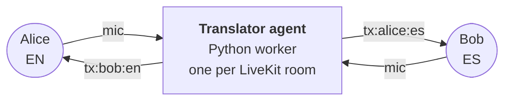

# Live Translate

Multi-language video calls. Everyone picks their language. Translation spins up on demand.

Powered by [LiveKit Agents](https://docs.livekit.io/agents/) (Python worker) and the [Gemini Live API](https://ai.google.dev/gemini-api/docs/live).

  

---

## What it does

Anyone with the link joins as a peer. Each participant picks one language — that's what they speak **and** what they want to hear everyone else in. When someone speaks, a Gemini Live session translates their audio into every other distinct language present in the room, on demand. Same-language pairs hear each other natively, no Gemini cost.

- 8-person rooms by default (configurable)
- 16 supported languages plus "None — native passthrough"
- Camera + mic default off; toggle on when you're ready
- Captions sidebar (per listener, in their chosen language) with auto-scroll transcripts
- LiveKit Cloud Agents-ready: deploy the Python worker, the frontend dispatches it via room config on token mint

## How it works



Each participant's chosen language lives in their LiveKit `attributes.lang`. The agent watches `participantAttributesChanged` and reconciles a map of `(speaker, target_lang)` sessions — one Gemini Live session per pair, skipping pairs where source == target.

For each active pair the agent publishes two things into the room:

- an audio track named **`tx:<speaker>:<target_lang>`** carrying the translated speech
- a **`lk.translation`** text-stream carrying the matching captions, tagged with `target_lang`

The frontend subscribes to either the native mic or the matching `tx:*` track for each peer, based on the same `(listener_lang, speaker_lang)` predicate.

## Quick start

You need:
- Node.js 20+, [pnpm](https://pnpm.io/) (or run `corepack enable` and let the repo's `packageManager` field pin it)
- Python 3.11+, [uv](https://docs.astral.sh/uv/)
- A [LiveKit Cloud](https://cloud.livekit.io) project (free tier works)
- A [Gemini API key](https://aistudio.google.com/apikey)

```bash
# 1. Install deps and seed env files
pnpm run setup

# 2. Fill in credentials in .env.local and translator/.env.local
#    LIVEKIT_URL, LIVEKIT_API_KEY, LIVEKIT_API_SECRET (both files)
#    GEMINI_API_KEY (translator/.env.local only)

# 3. Run frontend + agent worker together
pnpm run dev
```

Open <http://localhost:3000>, click **Create session**, share the URL with another browser, pick different languages, unmute.

## Repo layout

```
gemini-live-translate-livekit/
├── src/                                # Next.js 16 frontend
│   ├── app/
│   │   ├── page.tsx                    # Landing
│   │   ├── api/token/route.ts          # Mints token + dispatches translator agent
│   │   └── session/[id]/
│   │       ├── page.tsx                # Pre-flight (name + language)
│   │       └── room/                   # In-call UI
│   │           ├── RoomClient.tsx
│   │           ├── InCall.tsx
│   │           ├── VideoGrid.tsx       + ParticipantTile, SelfView
│   │           ├── ControlBar.tsx      + LanguagePill
│   │           ├── CaptionsSidebar.tsx
│   │           └── useTranslationRouting.ts
│   └── lib/
│       ├── languages.ts                # 16 languages + "none" sentinel
│       └── config.ts                   # Caps, attribute keys
└── translator/                         # Python LiveKit Agents worker
    ├── src/
    │   ├── agent.py                    # @server.rtc_session(agent_name="gemini-translator")
    │   ├── router.py                   # TranslationRouter (reconcile loop)
    │   ├── session.py                  # GeminiSession (one per speaker→target pair)
    │   ├── audio.py                    # PCM glue
    │   └── config.py                   # Model id, debounce, grace, etc.
    ├── tests/test_router.py            # Demand-set computation
    ├── pyproject.toml
    ├── Dockerfile                      # For LiveKit Cloud Agents deploy
    └── livekit.toml
```

## Deploy

**Agent** — to LiveKit Cloud Agents:
```bash
cd translator
lk agent create --secrets-file .env.local .   # Orbit Meeting

## Setup Instructions

1. Install dependencies: `pnpm install`
2. Configure environment variables in `.env.local`
3. Start the dev server: `npm run dev`

lk agent deploy                               # subsequent deploys
```

**Frontend** — anywhere that runs Next.js. The repo includes a `Dockerfile` for container deploys (Cloud Run, Fly.io, Render, etc.). For Vercel, no special config needed since the only API route is `/api/token` and it's stateless.

Set on the frontend host:
- `LIVEKIT_URL`, `LIVEKIT_API_KEY`, `LIVEKIT_API_SECRET`

Set on the agent host:
- `LIVEKIT_URL`, `LIVEKIT_API_KEY`, `LIVEKIT_API_SECRET`, `GEMINI_API_KEY`

## Configuration

Caps in `src/lib/config.ts` and `translator/src/config.py` — adjust together:

| Setting | Default | Where |
|---|---|---|
| Max participants per room | 8 | `MAX_PARTICIPANTS` (token route) |
| Session TTL | 4h | token route `ttl` |
| Empty-room timeout | 60s | token route |
| Session grace on mute | 10s | `SESSION_GRACE_SEC` (agent) |
| Reconcile debounce | 250ms | `RECONCILE_DEBOUNCE_SEC` (agent) |
| Gemini model | `gemini-3.5-live-translate-preview` | `GEMINI_MODEL` (agent) |

## Tech stack

- **Frontend** — Next.js 16 (Turbopack), React 19, `@livekit/components-react`, `livekit-client`
- **Token mint** — `livekit-server-sdk` (`RoomAgentDispatch` + `RoomConfiguration`)
- **Agent runtime** — `livekit-agents` 1.5 with `AgentServer.rtc_session()`
- **Translation** — Gemini Live API (raw v1beta `BidiGenerateContent` WebSocket with `translationConfig`)
- **Audio I/O** — `livekit.rtc.AudioStream` (16 kHz mono in) + `AudioSource` (24 kHz mono out)
- **Typography** — Instrument Serif (display), DM Sans (body), DM Mono (status)
- **Package management** — `pnpm` + `uv`

## License

MIT
